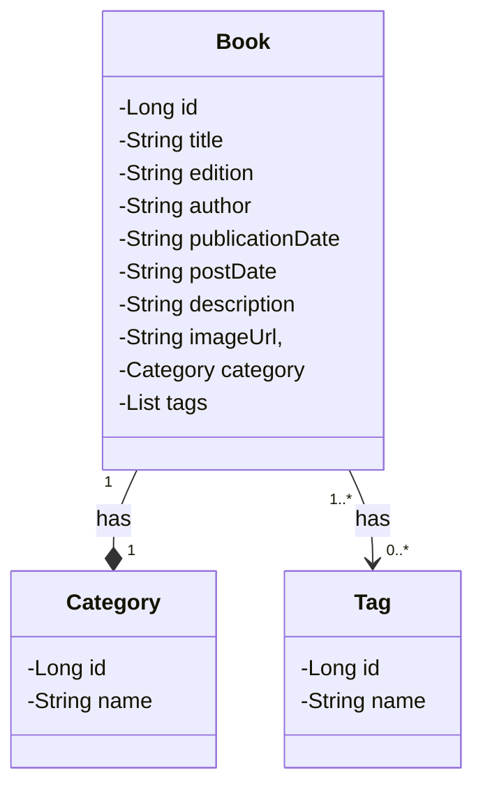

# BootCamp-Java-Angular

Projetos desenvolvidos no Bootcamp de Spring Boot em Java e Angular 17+

## API de livros online

```mermaid
classDiagram
    class Book {
        -Long id
        -String title
        -String edition
        -String author
        -String publicationDate
        -String postDate
        -String description
        -String imageUrl,
        -Category category
        -List<Tag> tags
    }
    
    class Category {
        -Long id
        -String name
    }

    class Tag {
        -Long id
        -String name
    }

    Book "1" --* "1" Category : has
    Book "1..*" --> "0..*" Tag : has
```
